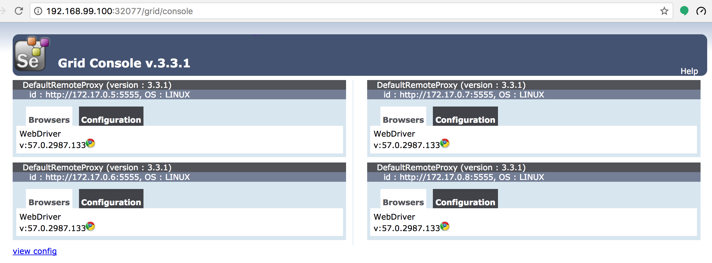
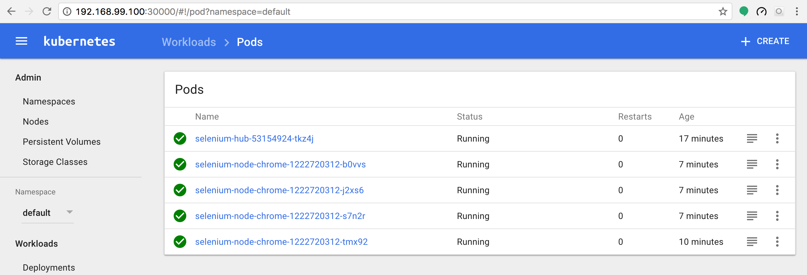

# KubeGrid
KubeGrid - Kubernetes way of orchestrating Docker-Selenium Grid

## Kubernetes
Kubernetes is an open-source system for automating deployment, scaling, and management of containerized applications.

### Basics of Kubernetes
  - Pods
  - Replication controllers
  - Services
  - Deployments

### pods
Basic unit of kubernetes workloads.Pod is a group of one or more containers, the shared storage for those containers, and options about how to run the containers.

### Replication controllers
ReplicationController makes sure that a pod or homogeneous set of pods are always up and available.

### Services
service provides a stable endpoint for group of pods managed by a replication controller

There are several ways of orchestrating a selenium grid using kubernetes
1. Using Minikube (local solution)
2. Using Google Container Registry (cloud solution)
    - Self-healing capability
3. Using kompose (docker-compose equivalent)

## Minikube
Minikube runs a single-node Kubernetes cluster inside a VM on your laptop for users looking to try out Kubernetes or develop with it day-to-day.

### Launching selenium hub
```sh
$ kubectl run selenium-hub --image selenium/hub:3.3.1 --port 4444
deployment "selenium-hub" created
$ kubectl get pods
NAME                          READY     STATUS    RESTARTS   AGE
selenium-hub-53154924-tkz4j   1/1       Running   0          43s
```
Expose selenium hub to be accessible
```sh
$ kubectl expose deployment selenium-hub --type=NodePort
service "selenium-hub" exposed
$ kubectl get services
NAME           CLUSTER-IP   EXTERNAL-IP   PORT(S)          AGE
kubernetes     10.0.0.1     <none>        443/TCP          2m
selenium-hub   10.0.0.186   <nodes>       4444:32077/TCP   46s
```
Selenium hub Url can be accessed through,
```sh
$ minikube service selenium-hub --url
http://192.168.99.100:32077
```
### Spin up Chrome Node
```sh
$ kubectl run selenium-node-chrome --image selenium/node-chrome:3.3.1 --env="HUB_PORT_4444_TCP_ADDR=selenium-hub" --env="HUB_PORT_4444_TCP_PORT=4444"
deployment "selenium-node-chrome" created
$   kubectl get pods
NAME                                    READY     STATUS              RESTARTS   AGE
selenium-hub-53154924-tkz4j             1/1       Running             0          7m
selenium-node-chrome-1222720312-tmx92   0/1       ContainerCreating   0          31s
```
### Scaling
```sh
$ kubectl scale deployment selenium-node-chrome --replicas=4
deployment "selenium-node-chrome" scaled
$  kubectl get pods
NAME                                    READY     STATUS    RESTARTS   AGE
selenium-hub-53154924-tkz4j             1/1       Running   0          10m
selenium-node-chrome-1222720312-b0vvs   1/1       Running   0          9s
selenium-node-chrome-1222720312-j2xs6   1/1       Running   0          9s
selenium-node-chrome-1222720312-s7n2r   1/1       Running   0          9s
selenium-node-chrome-1222720312-tmx92   1/1       Running   0          3m
```


### Minikube Dashboard
```sh
$ minikube dashboard
```


## Using Google Container Registry
Google Container Engine is also a quick way to get Kubernetes up and running: https://cloud.google.com/container-engine/
Your cluster must have 4 CPU and 6 GB of RAM to complete the example up to the scaling portion.
### Create Selenium Hub
```sh
$ kubectl create -f selenium-hub-rc.yml
```
Lets create a service for nodes to connect to,
```sh
$ kubectl create -f selenium-hub-service.yml
```
Selenium hub can be exposed to public to access the hub,
```sh
$ kubectl expose rc selenium-hub --name=selenium-hub-external --labels="app=selenium-hub,external=true" --type=LoadBalancer
```
Exposing a selenium hub to public is not secure and preferrable. It is intended here just for a showcase,
```
$ kubectl get services
```
### Spin up Chrome & Firefox Nodes
Now since hub is up and exposed lets spin up nodes and register into hub,
```sh
$ kubectl create -f selenium-node-chrome-rc.yml
$ kubectl create -f selenium-node-firefox-rc.yml
```
Now nodes are up and registered to hub created above can be seen in exposed selenium-hub's console.
## Self-Healing Capability
One of the greatest adavantage of kubernetes is Self healing.Though docker-swarm also supports self-healing, kubernetes is more reliable solution over a period of time due to replication controllers.
To demonstrate lets get the list of pods created,
```sh
$ kubectl get pods
NAME                         READY     STATUS    RESTARTS   AGE
selenium-hub-6m8v1           1/1       Running   1          1h
selenium-node-chrome-p6fkn   1/1       Running   0          1h
selenium-node-chrome-pv46k   1/1       Running   0          1h
```
Let's delete a google chrome node using below command,
```sh
$ kubectl delete pod selenium-node-chrome-pv46k
pod "selenium-node-chrome-pv46k" deleted
```
Now again get list of pods (chrome nodes),
```sh
$ kubectl get pods
NAME                         READY     STATUS    RESTARTS   AGE
selenium-hub-6m8v1           1/1       Running   2          1h
selenium-node-chrome-p6fkn   1/1       Running   0          1h
selenium-node-chrome-phb0c   1/1       Running   0          50s
```
We can see that without few seconds selenium hub replication controller automatically generates a new chrome node or pod ```selenium-node-chrome-phb0c ``` and assigns itself.
Replication Controller is one of the greatest asset of kubernetes to manage nodes automatically in a cluster.

## kompose
